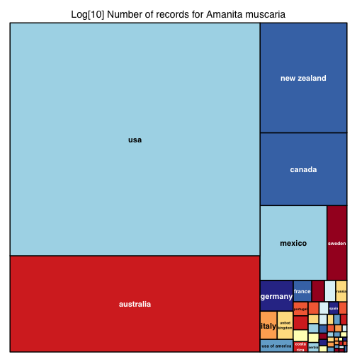
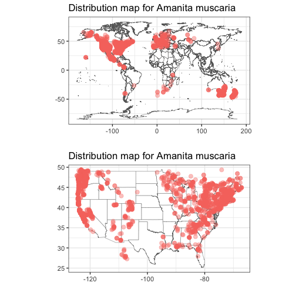
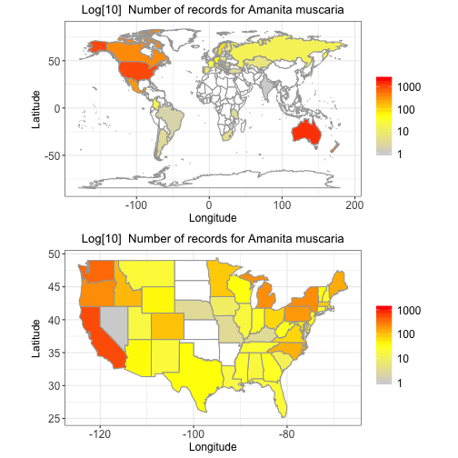
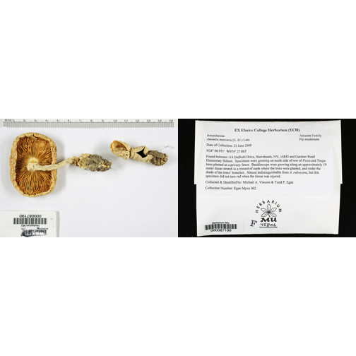

# The MyCoPortal

The Mycology Collections data Portal (MyCoPortal) is a database of fungal diversity with records mainly from North America. For more - and detailled - information, please visit http://mycoportal.org/portal/index.php.

The rMyCoPortal R package is an interface to the content stored on the MyCoPoral website. It allows to download records from the database readily in R for further analysis. It further provides some basic plotting functions. Below I will show the basic usability and some further possibilites of using the data.

# Install rMyCoPortal

```r
install.packages("devtools")
devtools::install_github("FranzKrah/rMyCoPortal")
```

## Docker

Before we start using rMyCoPortal, we need to install docker (https://docs.docker.com/install/). Docker performs  virtualization, also known as "containerization". rMyCoPortal interally uses the R package RSelenium to create a Selenium Server from which the MyCoPortal website is addressed. 
Docker needs to run before using the rMyCoPortal.

# Download records for *Amanita muscaria*, the fly agaric


```r
## Load library
library("rMyCoPortal")
```

```
## Warning: replacing previous import 'XML::xml' by 'rvest::xml' when loading
## 'rMyCoPortal'
```

```r
## Download records

am.rec <- mycoportal(taxon = "Amanita muscaria")
```

```
## Port is allocated 
## Server is running 
## Open website
## Send user query to website:
##              taxon 
## "Amanita muscaria" 
## Downloading 7 pages
## Make sure you have a stable internet connection!
## page ( 1 ) ...download ...done 
## page ( 2 ) ...download ...done
## page ( 3 ) ...download ...done
## page ( 4 ) ...download ...done
## page ( 5 ) ...download ...done
## page ( 6 ) ...download ...done
## page ( 7 ) ...download ...done
## 6636 records were downloaded 
## Close website and quit server
```

```r
am.rec
```

```
## Distribution table with 6636 records
```

```r
head(am.rec@records)
```

```
##   Symbiota.ID Collection Catalog.Number      Family
## 1     2136920         MU      000087190 Amanitaceae
## 2     2133368         MU      000139002 Amanitaceae
## 3     2136881         MU      000139283 Amanitaceae
## 4     2136886         MU      000139284 Amanitaceae
## 5     2136890         MU      000139285 Amanitaceae
## 6     2136892         MU      000139286 Amanitaceae
##                        Scientific.Name Country State.Province     County
## 1     Amanita muscaria  (L.: Fr.) Lam.     USA       New York    Chemung
## 2     Amanita muscaria  (L.: Fr.) Lam.     USA         Oregon    Klamath
## 3     Amanita muscaria  (L.: Fr.) Lam.     USA           Ohio     Butler
## 4 Amanita muscaria var. formosa  Pers.     USA           Ohio     Preble
## 5 Amanita muscaria var. formosa  Pers.     USA           Ohio Columbiana
## 6     Amanita muscaria  (L.: Fr.) Lam.     USA           Ohio      Perry
##                                                                              Locality
## 1 Found between 114 Daffodil Drive, Horseheads and Gardner Road Elementary School,...
## 2                  Upper Munson Meadow, Crater Lake National Park, 42.9405 -122.13384
## 3        Miami University Bachelor Wildlife Preserve, near Oxford, 39.53832 -84.72901
## 4 Swan-Beatty Rd, Pleasant Vineyard Retreat Center, Somers Township, sect. 20, 39....
## 5    Sprucevale area, Beaver Creek State Park, St. Clair Township, 40.72578 -80.61316
## 6                                                    Perry County, 39.73715 -82.23614
##   Habitat Host Elevation       Event.Date     Collector Number
## 1                    301     23 June 2009 M. A. Vincent    002
## 2                   1981   22 August 1962   W. B. Cooke  33584
## 3                    249 07 November 1992     J. Studer     23
## 4                    298     29 July 1992 M. A. Vincent   5627
## 5                    265  02 October 1993 M. A. Vincent   6413
## 6                    299  07 October 1992     T. Lanese    028
##   Individual.Count Life.Stage  Sex              coord      lat        lon
## 1                          NA <NA>               <NA>       NA         NA
## 2                          NA <NA> 42.9405 -122.13384 42.94050 -122.13384
## 3                          NA <NA> 39.53832 -84.72901 39.53832  -84.72901
## 4                          NA <NA>               <NA>       NA         NA
## 5                          NA <NA> 40.72578 -80.61316 40.72578  -80.61316
## 6                          NA <NA> 39.73715 -82.23614 39.73715  -82.23614
##               spec
## 1 Amanita muscaria
## 2 Amanita muscaria
## 3 Amanita muscaria
## 4 Amanita muscaria
## 5 Amanita muscaria
## 6 Amanita muscaria
```

## Visualization
We can now use several plotting methods to visualize the data.


```r
x <- am.rec

## plot_recordstreemap can be used to visualize relative importance of aspects of the data
plot_recordstreemap(x = x, groupvar = "country", log = FALSE) # e.g., the country distribution
```



```r
## plot_distmap can be used to plot interactive and static distribution maps
p1 <- plot_distmap(x = x, mapdatabase = "world", interactive = FALSE, plot = FALSE) # the default is interactive
```

```
## Rendering map...plotting 4870 points. Not all records have coordinates.
```

```r
# same for states
p2 <- plot_distmap(x = x, mapdatabase = "state", interactive = FALSE, plot = FALSE)
```

```
## Rendering map...plotting 2412 points. Not all records have coordinates.
```

```r
cowplot::plot_grid(p1, p2, ncol = 1, align = T)
```



```r
## plot_datamap can be used to plot heatmaps for either records or species richness (index = "rich")
p3 <- plot_datamap(x = x, mapdatabase = "world", index = "rec", plot = FALSE)

## the same but cropped to Europe
p4 <- plot_datamap(x = x, mapdatabase = "state", index = "rec", plot = FALSE)

cowplot::plot_grid(p3, p4, ncol = 1, align = TRUE)
```



```r
## And we can look up details for specific specimens
library(magick)
```

```
## Linking to ImageMagick 6.9.9.39
## Enabled features: cairo, fontconfig, freetype, lcms, pango, rsvg, webp
## Disabled features: fftw, ghostscript, x11
```

```r
det <- details(x@records[1,1])
length(det$urls)
```

```
## [1] 4
```

```r
par(mfrow = c(1,2), mar = c(0,0,0,0))
plot(image_read(det$urls[1]))
plot(image_read(det$urls[3]))
```


